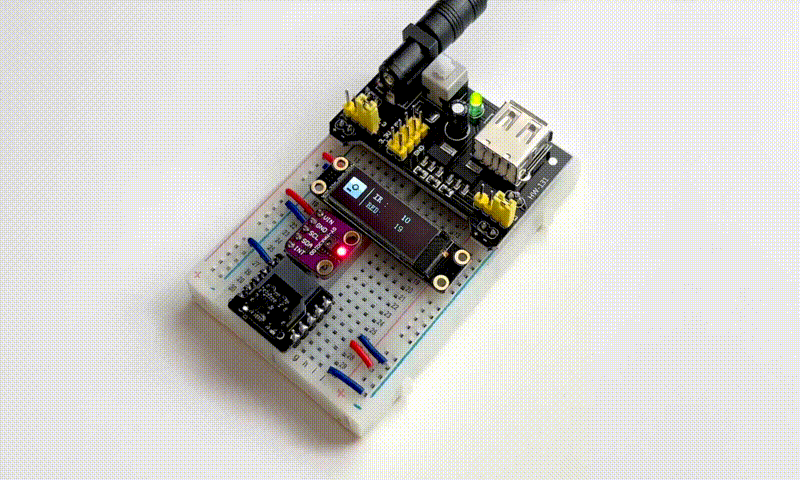
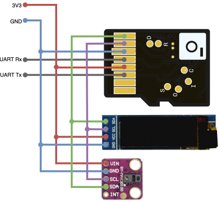

# Signaloid C0-microSD LiteX Integration with I2C interface
This is an example RISC-V SoC implementation with an I2C interface on the Signaloid C0-microSD FPGA that can run C/C++ software.  
This project offers Makefiles to build and flash the FPGA bitstream, and the firmware binary.



## Components
This project uses the following main components:
- 1x [Signaloid C0-microSD compute module](https://c0-microsd-docs.signaloid.io/): a Lattice iCE40 based compute module in a microSD form factor.
- 1x [MAX30100 Pulse/Oxymeter sensor](https://www.maximintegrated.com/en/products/MAX30100.html): a sensor that integrates a pulse oximeter and heart-rate monitor.
- 1x [SSD1306 128x32 OLED display](https://www.adafruit.com/product/931): a small OLED display with 128x32 pixel resolution.
- 1x [microSD card breakout board](https://www.adafruit.com/product/4682): to connect the Signaloid C0-microSD to the breadboard.
- Connecting wires and a breadboard.
- 3.3V Power supply.

### Connection Schematic


## Gateware
This example extends the default Signaloid C0-microSD target design from *litex-boards*, and adds an I2C interface.
It consists of:
- The Base SoC design, with IM support:
	- VexRISC-V-Lite SoC, with IM support.
	- UART interface for serial communication support.
	- 12MHz default system clock.
	- 128kiB SRAM.
	- 14MiB binary & files storage on SPI Flash.
- An I2C interface, with the following features:
	- I2C Master Hard IP from the Lattice iCE40UP fabric.
	- 400kHz I2C bus speed.
	- Pull-up resistors on SDA & SCL.

## Firmware
The firmware implements an I2C example, which reads the raw IR & red LED data from a MAX30100 Pulse/Oxymeter sensor, and displays them on an SSD1306 128x32 OLED display. All data is communicated over I2C. Also, application flow, all sensor data, and LED states are printed on UART.

For the purposes of this project, we modified and used the following repositories:
- [LibDriver SSD1306 OLED Display driver](https://github.com/libdriver/ssd1306)
- [xcoder123 MAX30100 Pulse/Oxymeter driver](https://github.com/xcoder123/MAX30100) 

## Getting Started
> [!NOTE]  
> This repository assumes that you have already installed the following tools:
> - [Yosys](https://github.com/YosysHQ/yosys)
> - [nextpnr](https://github.com/YosysHQ/nextpnr)
> - [IceStorm](https://github.com/YosysHQ/icestorm)
> - [RISC-V GNU Toolchain](https://github.com/riscv/riscv-gnu-toolchain), for RV32IM ISA extension
> 
> We recommend using the [OSS CAD Suite](https://github.com/YosysHQ/oss-cad-suite-build) to install `Yosys`, `nextpnr`, and `IceStorm`.


#### Clone this repository
To clone this repository recursively, run the following command:
```sh
git clone --recursive git@github.com:signaloid/Signaloid-C0-microSD-litex-I2C-demo.git
```

If you forgot to clone with `--recursive` and end up with empty submodule directories, you can remedy this with:
```sh
git submodule update --init --recursive
```

You can update all submodules with the following commands:
```sh
git pull --recurse-submodules
git submodule update --remote --recursive
```

#### Prepare virtual environment
Run the environment preparation make command, on the project's root directory:
```sh
make prep
```

#### Build and flash both gateware and firmware 
Before running this, make sure that the `CROSS_COMPILE_PATH` variable is properly set in the `config.mk` file with the installation path of the [RISC-V GNU Toolchain](https://github.com/riscv/riscv-gnu-toolchain) for RV32IM ISA extension. Its default value is set to `opt/riscv32im/bin`. Also, make sure that the `DEVICE` variable in the `config.mk` file is set to the correct device path (follow the [Identify the Signaloid C0-microSD](https://c0-microsd-docs.signaloid.io/guides/identify-c0-microsd) guide).
Run this in the project's root directory:
```sh
make flash
```

## Structure
This repository consists of several subdirectories.
- `gateware/`: LiteX SoC design.
- `firmware/`: C/C++ based code example.
- `build/`: LiteX **generated** directory after the building process. Contains the FPGA design bitstream, the LiteX generated C libraries, the compiled firmware binary, and the LiteX autogenerated documentation.
- `submodules/`: Dependencies on tools outside this repository.
	- C0-microSD-utilities: C0-microSD-toolkit for flashing purposes.

## Makefiles
- `Makefile`: Main Makefile for building and flashing both gateware and firmware.
- `firmware/Makefile`: Makefile for building and flashing the firmware only. For more details see `firmware/README.md`.

You should run the following commands from the project's root directory, where the main Makefile is located.
- `make`: Build both gateware and firmware.
	This command:
	1. Prepares the environment for development, if it not already prepared.
	2. Builds the LiteX gateware, and software libraries.
	3. Proceeds with synthesis, place 'n' route, and pack to the final bitstream.
	4. Builds the LiteX autogenerated SoC documentation, in the `build/signaloid_c0_microsd/docs/html/` directory.
	5. Builds the C firmware.
- `make flash`: Flash both gateware and firmware.
- `make clean`: Clean all build files.
- `make clean-env`: Clean the Python virtual environment.
- `make prep`: Prepare the environment for development.
	This command:
	1. Clones all git submodules in the *submodules* directory.
	2. Creates a python virtual environment at `.venv`.
	3. Installs all required python packages defined in the *requirements.txt* file using pip.
- `make gateware`: Build the gateware.
- `make flash-gateware`: Flash the gateware.
- `make test-target`: Test the gateware target script for verilog compilation errors.
- `make firmware`: Build the C firmware.
- `make flash-firmware`: Flash the firmware.
- `make clean-firmware`: Clean the firmware build files.
- `make print-vars-firmware`: Print the firmware Makefile variables.
- `make print-vars`: Print the main Makefile variables.


## Gateware Bitstream
The gateware bitstream is stored in the `build/signaloid_c0_microsd/gateware/` directory with the name `signaloid_c0_microsd.bin`.

## Firmware Binary
The firmware binary is stored in the `build/signaloid_c0_microsd/software/` directory with the name `signaloid_c0_microsd_firmware.bin`.
