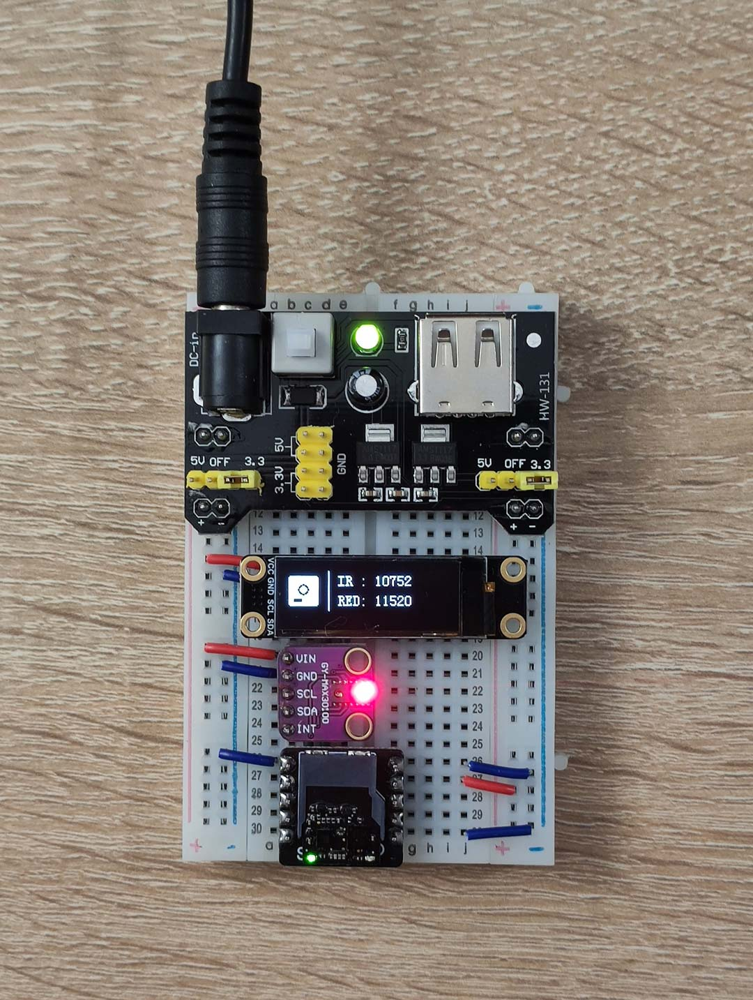

# Signaloid C0-microSD Litex Integration with I2C interface
This is an example RISC-V SoC implementation with an I2C interface on the Signaloid C0-microSD FPGA that can run C/C++ software.  
This project offers Makefiles to build and flash the FPGA bitstream, and the firmware binary.



## Gateware
This example extends the default Signaloid C0-microSD target design from *litex-boards*, and adds an I2C interface.
It consists of:
- The Base SoC design, with IM support:
	- VexRISC-V-Lite SoC, with IM support.
	- UART interface for serial communication support.
	- 12MHz default system clock.
	- 128kiB SRAM.
	- 14MiB binary & files storage on SPI Flash.
- An I2C interface, with the following features:
	- I2C Master Hard IP from the Lattice iCE40UP fabric.
	- 400kHz I2C bus speed.
	- Pull-up resistors on SDA & SCL.

## Firmware
The firmware implements an I2C example, which reads the raw IR & red LED data from a MAX30100 Pulse/Oxymeter sensor, and displays them on an SSD1306 128x32 OLED display. All data is communicated over I2C. Also, application flow, all sensor data, and LED states are printed on UART.

For the purposes of this project, we modified and used the following repositories:
- [LibDriver SSD1306 OLED Display driver](https://github.com/libdriver/ssd1306)
- [xcoder123 MAX30100 Pulse/Oxymeter driver](https://github.com/xcoder123/MAX30100) 

## Getting Started
> [!NOTE]  
> This repository assumes that you have already installed the following tools:
> - [Yosys](https://github.com/YosysHQ/yosys)
> - [nextpnr](https://github.com/YosysHQ/nextpnr)
> - [IceStorm](https://github.com/YosysHQ/icestorm)
> - [RISC-V GNU Toolchain](https://github.com/riscv/riscv-gnu-toolchain), for RV32IM ISA extension
> 
> We recommend using the [OSS CAD Suite](https://github.com/YosysHQ/oss-cad-suite-build) to install `Yosys`, `nextpnr`, and `IceStorm`.


#### Clone this repository
To clone this repository recursively, run the following command:
```sh
git clone --recursive git@github.com:signaloid/Signaloid-C0-microSD-litex-I2C-demo.git
```

If you forgot to clone with `--recursive` and end up with empty submodule directories, you can remedy this with:
```sh
git submodule update --init --recursive
```

You can update all submodules with the following commands:
```sh
git pull --recurse-submodules
git submodule update --remote --recursive
```

#### Prepare virtual environment
Run the environment preparation make command, on the project's root directory:
```sh
make prep
```

#### Build and flash both gateware and firmware 
Before running this, make sure that the `CROSS_COMPILE_PATH` variable is properly set in the `config.mk` file with the installation path of the [RISC-V GNU Toolchain](https://github.com/riscv/riscv-gnu-toolchain) for RV32IM ISA extension. Its default value is set to `opt/riscv32im/bin`. Also, make sure that the `DEVICE` variable in the `config.mk` file is set to the correct device path (follow the [Identify the Signaloid C0-microSD](https://c0-microsd-docs.signaloid.io/guides/identify-c0-microsd) guide).
Run this in the project's root directory:
```sh
make flash
```

## Structure
This repository consists of several subdirectories.
- `gateware/`: LiteX SoC design.
- `firmware/`: C/C++ based code example.
- `build/`: Litex **generated** directory after the building process. Contains the FPGA design bitstream, the Litex generated C libraries, the compiled firmware binary, and the Litex autogenerated documentation.
- `submodules/`: Dependencies on tools outside this repository.
	- C0-microSD-utilities: C0-microSD-toolkit for flashing purposes.

## Makefiles
This repository contains two Makefiles, one for the gateware, the main `Makefile`, and one for the firmware, the `firmware/Makefile`. The firmware Makefile is included in the main Makefile, so you can run its commands from both the `firmware/` and the project's root directory. For details on the firmware Makefile, see the `firmware/README.md` file.

You should run the following commands from the project's root directory, where the main Makefile is located.


#### Build both gateware and firmware
To build both gateware and firmware run:
```sh
make
```

This command:
1. Prepares the environment for development, if it not already prepared.
2. Builds the Litex gateware, and software libraries.
3. Proceeds with synthesize, place 'n' route, and pack.
4. Builds the Litex autogenerated SoC documentation, in the `build/signaloid_c0_microsd/docs/html/` directory.
5. Builds the C firmware.


#### Flash both gateware and firmware
To flash both gateware and firmware run:
```sh
make flash
```

#### Clean all build files
To delete all generated files except the virtual environment run:
```sh
make clean
```

#### Clean all virtual environment files
```sh
make clean-env
```

#### Prepare the environment for development
To prepare the environment run:
```sh
make prep
```

This command:
1. Downloads all git submodules in the *submodules* directory.
2. Creates a python virtual environment at *.venv*.
3. Installs all python required packages defined on the *requirements.txt* file using pip.


#### Build the gateware
To build the SoC bitstream run:
```sh
make gateware
```

#### Flash the gateware
To flash the SoC bitstream to the Signaloid C0-microSD run:
```sh
make flash-gateware
```

#### Test the gateware target script for verilog compilation errors
This is useful for debugging the target script. To test for verilog compilation errors run:
```sh
make test-target
```

#### Build the C firmware
To build the SoC firmware run:
```sh
make firmware
```

#### Flash the firmware
To flash the SoC firmware to the Signaloid C0-microSD run:
```sh
make flash-firmware
```

#### Clean the firmware build files
To clean the SoC firmware build files run:
```sh
make clean-firmware
```

#### Print the firmware Makefile variables
To print all the variables of the firmware Makefile run:
```sh
make print-vars-firmware
```

#### Print the main Makefile variables
To print all the variables of the main Makefile run:
```sh
make print-vars
```

## Gateware Bitstream
The gateware bitstream is stored in the `build/signaloid_c0_microsd/gateware/` directory with the name `signaloid_c0_microsd.bin`.

## Firmware Binary
The firmware binary is stored in the `build/signaloid_c0_microsd/software/` directory with the name `signaloid_c0_microsd_firmware.bin`.
